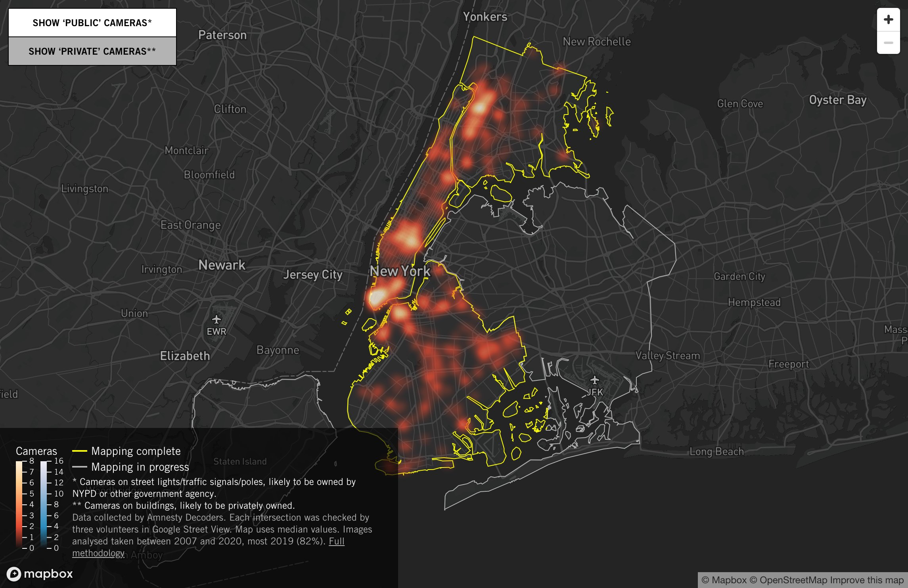
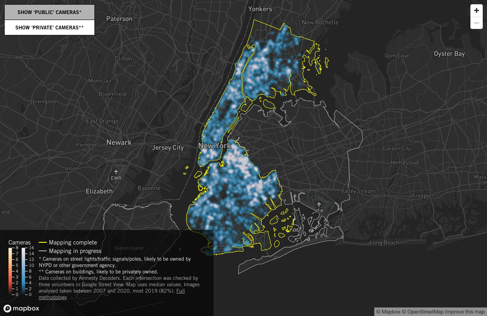

#vie_privée

Le premier enregistrement de passsants sur la voie publique date de 1973 à Times Square.
Aujourd'hui, le système de contrôle chinois dispose en 2020 de 200 millions de caméras de surveillance, soit 1 pour 6 individus, avec la promesse d'en tripler le nombre. 

Les caméras de surveillance font partie de l'arsenal technologique de la surveillance urbaine depuis les années 2000. 

Les caméras de surveillance sont également présentes au travail. Présentées par les employeurs comme des moyens de sécuriser la vie et le travail des salairés, elles sont régulièrement dénoncées à la CNIL comme des moyens pour ces derniers de leur mettre la pression et de les humilier[[@BieriQuanddonneespersonnelles2021]]. 
Si la surveillance est discontinue (les caméras ne fonctionnent pas toutes en même temps, et toutes ne fonctionnent pas), il suffit comme l'indiquait [[Michel Foucault]] en présentant le [[Panoptique de Bentham]], qu'une caméra soit présente, en fonction ou non, pour que le comportement de la personne dans cette même pièce soit modifié. 

# emblème du solutionnisme technologique

Elles se sont multipliées en France pour des raisons sécuritaires, sans qu'il soit possible de déterminer si elles ont contribué ne serait-ce qu'un peu à faire baisser la délinquance. Le sociologue [[Laurent Mucchielli]]  et le journaliste [[Jean-Marc Manach]] soutiennent depuis 2009 et 2010 que ce n'est pas le cas. 

Leur contribution à l'élucidation des enquêtes serait quasiment nulle, d'après ces auteurs (de l'ordre de 3,5% sur le nombre total de réquisitions d'images, d'après Laurent Mucchielli [[@GuillaudVideosurveillanceparadigmetechnosolutionnisme2018]]).

Leur prolifération est donc du à un usage politique : en installant des caméras partout, les édiles municipaux veulent montrer qu'ils sont actifs face à un problème qu'en réalité ils ne contrôlent pas, la délinquance. 
La caméra de surveillance urbaine relève donc du [[solutionnisme technologique]] technologique.

# La caméra de surveillance en tant qu'objet connecté.

En tant qu'objet connecté, les caméras de surveillance peuvent être facilement hackées. (cf site SHODAN permettant de voir les images des caméras très nombreuses dont le mot de passe et le nom d'adminstrateur n'ont pas été changés - admin / admin)

En tant qu'[[objects connectés]] facilement hackables, les caméras peuvent être des relais efficaces dans le cadre d'une attaque [[DDoS]] pour faire tomber certains serveurs cardinaux, comme ce fut le cas lors de l'attaque du virus Mirai en 2016 ([[@CadotToutceque2016]])

# caméras de surveillance et reconnaissance faciale

Si certaines villes comme San Francisco et Portland ont interdit les caméras à reconnaissance faciale dans les rues, certaines villes comme New York les ont implémentées de telle sorte qu'il est difficile de se trouver dans un endroit de cette ville qui ne soit pas équipée de caméra pouvant analyser son visage, d'après une enquête d'Amnesty International réalisée entre 2019 et 2021 avec 6000 volontaires.

([source](https://amnesty-crisis-evidence-lab.github.io/decode-surveillance-heatmap/))

