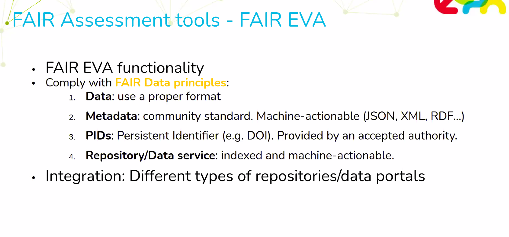
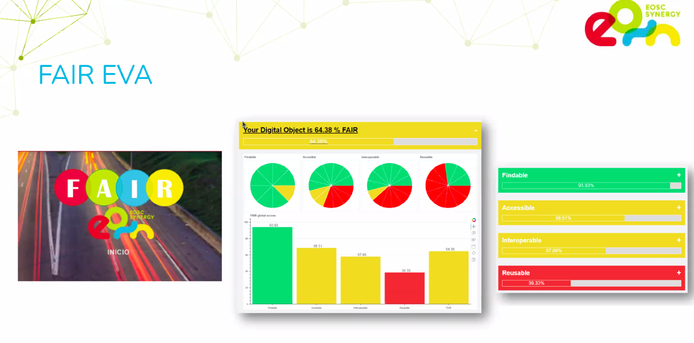
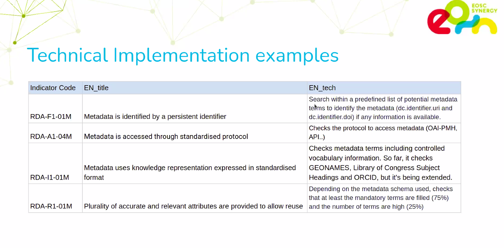
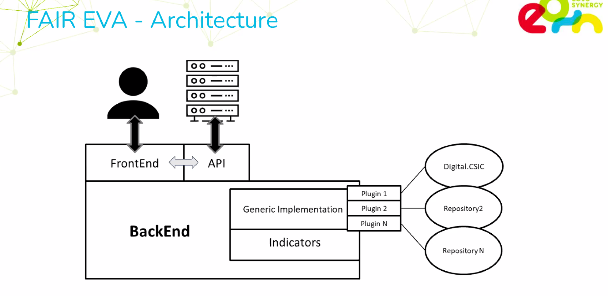
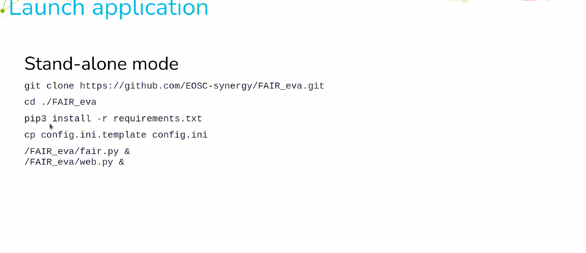
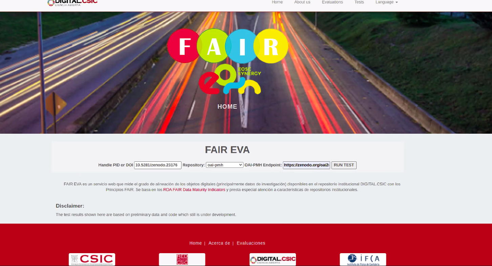
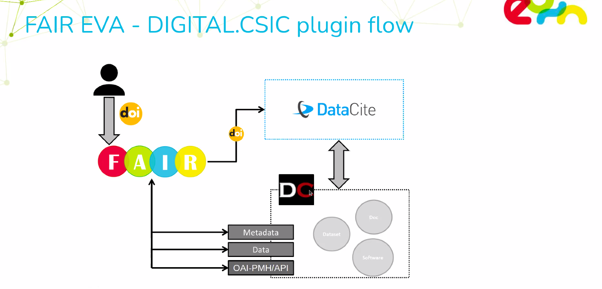
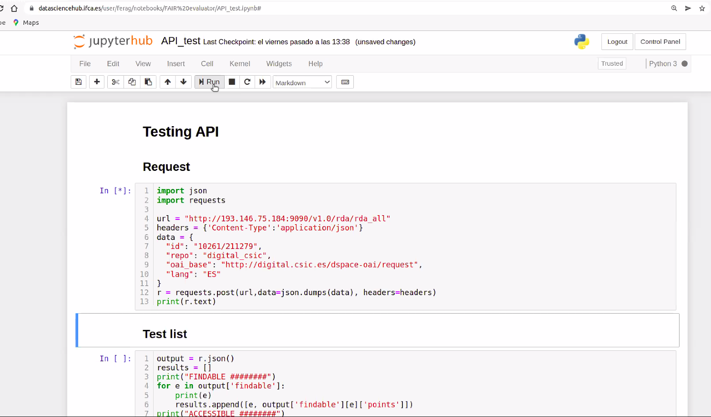

présentation de FAIR EVA (Evaluator, Validator, Advisor)
[Enregistrement de la présentation sur Youtube](https://youtu.be/YhSPUYbqIdo)

Fernando Aguilar Gomez IFCA-CSIC (aguilarf@ifca.unican.es), impliqué dans RDA (Research Data Alliance)
FAIR EVA conçu pour s'assurer de la qualité des métadonnées que l'on crée pour nos jeux de données. Evaluation de la compatibilité avec les principes [[FAIR]]

"create a FAIRness evaluation"

 \

 \

**Findable

 \

**Accessible

 \

**Interopérable, reusable

 \

not only evaluate, but also validate (label) and advise

application modulaire faite de plusieurs composants, la solution est conçue pour être flexible et adaptable à différentes communautés scientifiques

cible : déposants de données, administrateurs de portails, financeurs

développé en Python, dispose d'une API et d'une interface web.
possible de lancer l'outil Python avec Docker











ça fonctionne en localhost (localhost:5000)

Autres modes de fonctionnement (cf plus bas, mail reçu de l'auteur le 18 avril 2022) : 

"The tool has two different and main parts: the API and the web interface. You are running the API, so you can try to access using the URL ["http://localhost:9090/v1.0"](http://localhost:9090/v1.0). Otherwise, you can also run the web interface (web.py), which connects directly with the API.

If you want to run the docker container, you I'd suggest you to use the following command:

````shell
docker run --name=fair_eva -dit --network host ferag/fair_eva:latest
````

There is a version of the config.ini by default, but it probably need to be customized.""


on envoie le DOI de l'entrepôt



Quand le score n'est pas de 100% on reçoit des recommandations pour améliorer la FAIRité des données. 
On peut exporter le bilan en PDF

possibilité selon l'entrepôt de départ de configurer le fichier config en indiquant par exemple où trouver les informations relatives à la licence (dans le cas de Zotero c'est dans dc.rights)

implémentation de l'API sur l'entrepôt du CSI



intégration dans Jupyter



difficulté de trouver le endpoint d'un repository, pour Zenodo, c'est sur le site https://zenodo.org/oai2d
pas de menu déroulant avec la liste des dépôts liés à leurs _endpoints_. Il faut fournir l'un et l'autre. 