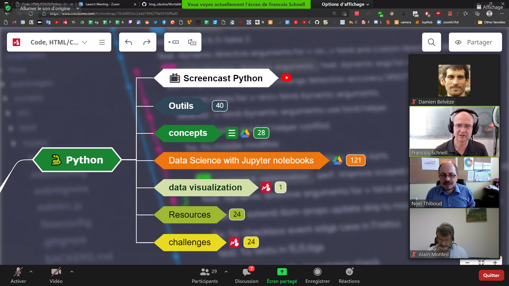

Voir  la présentation d'Aurélien Tabart sur les [[cahiers numériques]]

Présentation de François Schnell sur les Jupyter Notebooks (informaticien, Université de Strasbourg)

[carte mentale](https://www.mindomo.com/fr/mindmap/code-htmlcssjspython-78c64935ec2a4d1994270e5916fffa43)

attitude par rapport à l'apprentissage de la programmation : *Can you fly this thing ? Not yet*(Matrix)

*JuPyteR* : utiliser l'interopérabilité du HTML avec le langage Julia (datasciences), le langage [[Python]] et le langage de R

ne pas laisser les Jupyter Notebooks aux data scientists : utile à tous. 

2,7 millions de Jupyter Notebooks sur Github en 2018

Feynman : *si on veut maîtriser quelque chose, il faut l'enseigner*.

outil de programmation : Visual studio code. 
On peut avoir une conversation avec l'interpréteur comme sur Python. 

Dans un Jupyter notebook on peut beaucoup plus raconter un cheminement; possibilité d'exécuter de façon choisie telle ou telle cellule

utilisé par des journalistes de données pour donner à voir leur cheminement. ([exemple](https://www.rue89strasbourg.com/la-surmortalite-en-alsace-pendant-la-periode-covid-vue-depuis-les-chiffres-de-linsee-177809))

Outil très jeune, très utile pour enseigner la programmation. 

outil frontend séparé de la partie backend où se trouvera le code

Un jupyter notebook est un fichier texte avec un format ipynb, format compatible avec JSON, le format d'échange de données entre machines utilisées par les API.

``
pip install jupyter pandas matplotlib
``

Libraries
pandas : gère les panneaux de données (son, image)
matplotlib : visualisation

possibilité également d'installer avec anaconda

Lancer un serveur  qui ne va s'installer que dans le dossier Jupyter. (localhost)

shift enter le raccourci clavier le plus utilisé quand on tient un Jupyter notebook : pour obtenir un résultat (1+1 = 2)

Pour faire du Jupyter dans le Cloud : jupyterhub = serveur de notebook accessible via un compte personnel à créer.

kaggle : 400 000 notebooks créés à partir de jeu de données. Permet de créer très vite un notebook. 

https://colab.research.google.com : possibilité de modifier un notebook en temps réel. 

mode édition / mode commande
bien distinguer les cellules de code et les cellules de texte

en local utiliser tab ou shift tab pour afficher les options

Les textes sont rédigés en [[markdown]]

Importer un jeu de données

``
import pandas as pd
``
import de la librarie panda
``
import matplotlib as plt
``
import de la librairie Matplotlib
``
dfo = pd.read_csv("https://chemin du fichier.csv")
``
création du dataframe, lecture d'un jeu de données en CSV
La librarie panda est faite pour traiter de très gros jeux de données. 
Ces panneaux de données sont accompagnés de fonctions de datascience. 

dfo.describe()
dfo  = objet
describe = fonction
() = contenu sur lequel s'exerce cette fonction

``
dfo.head(2)
``
affiche les deux premières lignes du jeu de données

Quand on demande à Jupyter de faire une opération sans la mettre dans une variable à gauche elle sera temporaire

inplace=true 

modification de façon permanente le dataframe

Comme sur Python, afficher une table à l'aide d'un dictionnaire : 

``
df.Age.min() 
``
affiche le passager le plus jeune de la liste.

un seul = : on fixe une variable
deux == : on souhaite obtenir une égalité

Afficher le nom du passager le plus jeune : 

df.Age.count() : nombre de lignes NA (qui n'a pas de valeur définie dans la colonne Age)

avoir les âges les plus représentés

classer les index et les valeurs

trier par âge 

Visualisation 

Age.plot.bar

Probabilité de survie en fonction de l'âge et de la classe des passagers du Titanic (1ère, 2ème ou 3ème classe)

grouper les données 

influence de l'âge sur la probabilité de survie

# Bibliographie
