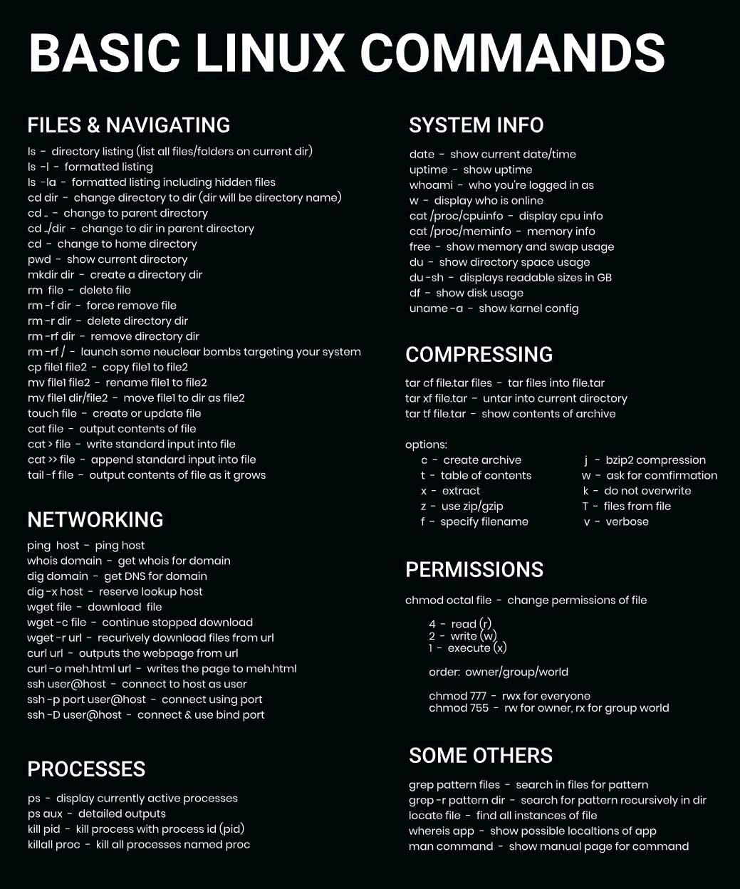

# gérer les dossiers et les fichiers

## Lister les fichiers

lister les fichiers d'un répertoire

`ls`

lister tous les fichiers textes dans un répertoire

`ls *.txt`

lister les fichiers (également cachés)

`ls -a`

lister les dossiers en même temps que les fichiers

`ls -p`

afficher les dossier et les fichiers avec les droits sur ces fichiers

`ls -al`

## naviguer dans les fichiers et les dossiers

A noter : les slashs ne sont pas les mêmes dans un terminal Windows (MS-DOS ou powershell par exemple) ou un terminal Linux ou Git-Bash : 
Accéder au répertoire sous Linux : 

`cd /users/ianmilligan1/mallet-2.0.7`

et sous Windows :

`cd c:\mallet-2.0.7\`

(le chemin change aussi /users/nomdelutilisateur/répertoire sous Linux, c:\\répertoire sous Windows

Se positionner sur un dossier:

``cd dossier``

ouvrir un dossier

`cd`seul permet de revenir à la racine

revenir au dossier parent : 

``cd ..``

remonter l'arborescence de deux niveaux : 

``cd ../..`` / trois niveaux : ``cd ../../..``

remonter à la racine : 

``cd /.``

~ est un raccourci pour désigner le dossier de l'utilisateur

``cd ~/etc/config`` est l'équivalent de ``cd /home/nomutilisateur/config``

Afficher le dossier où l'on se trouve

``pwd``

pwd = publication working directory : l'espace de travail

pour revenir au Home avec CD : 

`cd --`

donne le chemin absolu du dossier dans lequel on se trouve. 


voir [[architecture des fichiers Linux]]


## Créer un fichier

``touch fichier.txt``

*touch* sans argument crée un fichier. Avec -c ou -h il permet de changer le timestamp d'un fichier

On peut aussi créer un fichier en écrivant une ligne : 

``echo "voici mon texte" >> fichier.txt`` 

crée un fichier intitulé fichier.txt dans lequel on trouve la ligne *voici mon texte*

## Créer un dossier

`mkdir nomdudossier`

possibilité de créer plusieurs dossiers en même temps de même niveau 

`mkdir nomdudossier1 nomdudossier2 nomdudossier3`

ou une arborescence de dossiers

`mkdir -p nomdudossier1/nomdudossier2/nomdudossier3`


## Copier et déplacer des fichiers

`cp nomdufichier nomdudossier/`

copier des dossiers 

utiliser l'argument -r (recursive) pour indiquer qu'on veut copier le dossier mais aussi tous les éléments qu'il contient.

`cp -r nomdudossiersource/ nomdudossierdestination/`

déplacer des fichiers

`mv nomdufichier nomdudossier/`

déplacer des dossiers

`mv -r nomdudossiersource/ nomdudossierdestination/`

## renommer des fichiers ou des dossiers

`mv anciennomdudossier/ nouveaunomdudossier/`

## Supprimer des fichiers ou des dossiers

la commande `rm`permet de supprimer des fichiers ou des dossiers. Pour supprimer à la fois un dossier et son contenu, utiliser `rm -r dossier`

`rm -f`: suppression de fichiers protégés en écriture : à manier avec précaution

**attention la suppression avec rm est définitive**: pas de corbeille ou de possible restauration.

## retrouver un fichier

`locate document`

renvoie tous les fichiers qui ont document dans leur nom avec le chemin pour les localiser

(par exemple /etc/usr/bob/document.txt)

Pour mettre l'index de ces fichiers et avoir des résultats à jour : `updatedb`

Commande *find* permet de chercher tous les documents correspondants à certaines caractéristiques : 

`find . -name "twi*" -d`

permet d'afficher à partitr du dossier courant (.)la liste des dossiers (-d) dont le nom (-name) commence par les trois lettres twi (twi*)

`find . -name "photo*" -exec cp {} {}.bak \;`

trouve et copie (avec une extension .bak) tous les fichiers dont les noms débutent par "photo"

afficher la liste des fichiers qui ont une taille supérieure à 10mio (mebibytes) (1024*1024 octets)

`find . -size +10M`

-size : argument qui spécifie de chercher par taille
+ = plus de (on peut utiliser - ou =)
M: unité (en l'ocurrence Mio) pour des octets (bytes), on utilise c


## Afficher le contenu d'un fichier

`cat fichier`

affiche le contenu d'un fichier, idéal pour un fichier court. 
cat est l'abréviation de concatenate, donc peut servir à concaténer deux fichiers. 

`cat fichier1 fichier2`

concatène les fichiers 1 et 2

`cat fichier1 fichier2 > fichier 3`

concatène le fichier 1 et 2 dans un nouveau fichier 3

Pour afficher des textes longs et ainsi naviguer dedans, utiliser la commande **less**

Pour poursuivre sur l'écran d'affichage : 

parcourir le fichier à l'aide des flèches Haut/Bas, mais aussi faire de plus grand sauts avec les flèches Page Up/Page Down ;

quitter l'interface avec la touche q;

g permet de se rendre au début du fichier ;

G permet de se rendre en fin de fichier ;

écrire / suivi d'un mot permet de rechercher le mot dans le document.


par exemple, l'action `less /var/log/syslog`affiche la liste des dernières connexions au serveur. 

Pour ne retenir que 10 lignes depuis le début du fichier, utiliser la commande `head -n 10 /var/log/syslog`; à l'inverse, pour retenir les 10 dernières lignes du fichier, utiliser la commande `tail -n 10 /var/log/syslog`


## Utiliser l'éditeur de texte nano

`nano nomdufichier`

modifier le fichier, enregistrer avec Ctrl+O et Entrée
Quitter avec Ctrl+X


## manipuler des fichiers

### trouver des expressions avec grep : 

`grep "^anti-*" /usr/share/dict/french`

affiche tous les mots commençant par anti- du dictionnaire français présent dans share.

`grep -r "noir"`(avec le -r de la récursivité déjà vu plus haut) : affiche tous les dossiers dont le nom comporte le mot noir et dans ces dossiers tous les fichiers dont le nom et le contenu comportent le mot "noir"

## compter le nombre de mots, lignes, caractères d'un fichier

`wc document.txt`

si on a le résultat suivant : 

6 56 340 document.txt

cela signifie que notre document comporte 6 lignes, 56 mots et 340 caractères

`sort document.txt`

trie les lignes du document.txt par ordre alphabétique (ordre par défaut)

récupérer la liste de tous les mots français qui comporte le w

`grep "w" /usr/share/dict/french > ~/Documents/mots_w.txt`

envoie tous les mots du dictionnaire français qui comportent un w dans un fichier texte présent dans les documents

` wc ~/Documents/mots_w.txt`

affiche le nombre de lignes et de mots (équivalent ici) de ce fichier. 594 mots comportent la lettre w


# chaîner des commandes

on procède avec le pipe (|)


# mettre à jour des paquets

lister les paquets pouvant être mis à jour

`apt list --upgradable`

mettre à jour la liste des paquets

`sudo apt update`

mettre à jour les paquets pouvant être mis à jour

`sudo apt upgrade`


# installer des packages

Les packages pour Linux arrivent assez souvent sous la forme d'archives (tar.gz)
Pour extraire les dossiers d'une archive : 

````shell
tar -xvf nomdufichier.tar.gz
````

Si l'application se présente directement sous l'apparence d'un paquet debian (.deb)

````shell
deb -i nomdufichier.deb
````


# Bibliographie
