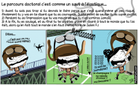

# Pourquoi les compétences dans l'enseignement supérieur

pourquoi les compétences dans l'enseignement supérieur 
- meilleure employabilité ? 

est-ce bien le but de l'université de préparer à l'employabilité
avons-nous réellement des problèmes d'employabilité

Les démarches compétences provoque des choses que l'entreprise aime bien (réactivité, adaptation), mais ce n'est pas une raison suffisante pour passer à l'APC

- meilleur engagement des étudiants dans leur formation ? 

C'est ce levier qui plaide le plus en faveur de l'APC

Est-ce que les tutelles ont vraiment raison de nous y inciter. Oui mais elles ne s'y prennent pas forcément très bien

exemple du jean à faire sécher. Les étudiants ont  les compétences physiques requises mais ils ne les appliquent pas à une situation concrète (analogie avec les les fils à haute tension, aux téléphériques, etc.)

autre exemple : projet GL de l'Ensimag

1 mois à temps complet par groupes de 5 à réaliser un prototype de compilateur sur la base d'un cahier des charges
groupes consitués au chois des étudiants
certains groupes constitués des formules 1 académiques réalisent des prototypes très moyens, voire mauvais

Pourquoi : manque de compétences transversales (cf. communiquer les uns avec les autres, documenter)

Lutter contre les savoirs validés sur le plan scolaire mais inutilisables dans la vraie vie de citoyen et de professionnel

La compétence doit revêtir un caractère intégrateur (et pas additif) ; elle intègre des connaissances empruntées à plusieurs domaines

compétence pluridisciplinaire, mêlant des apprentissages transverses et coeur de métier. Nécessite d'être exercée dans un cadre réaliste.

# alignement pédagogique

engager les étudiants dans une démarche réflexive. cela prend du temps, du coup pas très raisonnable de penser qu'on puisse travailler plus de trois compétences par semestre. 

Pédagogie par objectifs -> démarche par compétence complètement intégrée en complète pluri-disciplinarité

à un pôle, les UE disciplinaires vivent indépendamment les une des autres et sont des ressouces pour le développement des compétences
à l'autre pôle chaque UE est pluri-disciplinaire

Définir le référentiel de compétences de la formation en respectantun cadre théorique opérationnalisable
"authenticiser" autant que faire se peut les ifférentes mises en situation
les évaluer en termes de compétences
dégager du temps de travail étudiant pour les engager dans une démarche réflexive concernant le développement de leurs compétences, capitalisée dans un dispositif type port-folio

# l'écueil sémantique

Savoir distinguer [[compétence]] et savoir-faire : qu'est-ce qui différencie l'un et l'autre ? 
Il est nécessaire de se doter d'un cadre théorique et de s'entendre sur les définitions.
Le cadre théorique est un guide mais on peut aussi parfois faire des incartades à ce cadre

Jacques Tardif : la compétence est 

> un savoir-agir complexe consistant en une mobilisation et une combinaison efficace de ressources ([[Savoirs|savoirs]], [[savoirs-faire]], [[savoirs-être]]) internes ou externes dans une famille de situation"

attitude : position basse / on va voir si on peut vous aider à progresser dans tel ou  tel domaine. Question de posture.

cette vision est-elle compatible avec les fiches RNCP (France Compétences) ?

France Compétences : vision davantage métier bcp plus parcellaire, ce que l'on pourrait trouver dans une fiche de poste

Ces deux visions sont-elles compatibles ? 

Dans une très large mesure, c'est compatible à condition de résoudre cet écueil linguistique. Savoir traduire les compétences selon Tardif en compétences selon le RNCP. 
compétence RNCP = apprentissage critique ou  ressource pour Tardif

très dangereux d'entrer dans l'APC par les fiches RNCP : 
- risque de perdre le caractère intégrateur du RNCP
- possible absence de rencontre du coeur de métier et du tranverse) contextualiser le transverse par la discipline. 

# bibliographie

